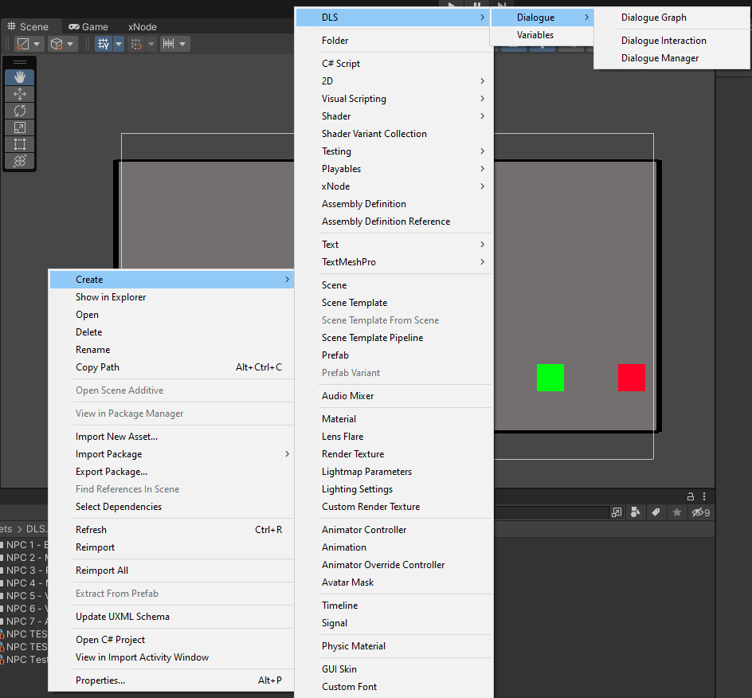
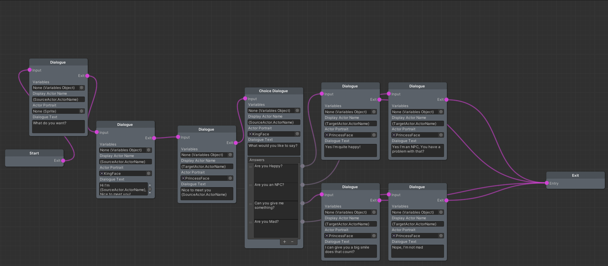
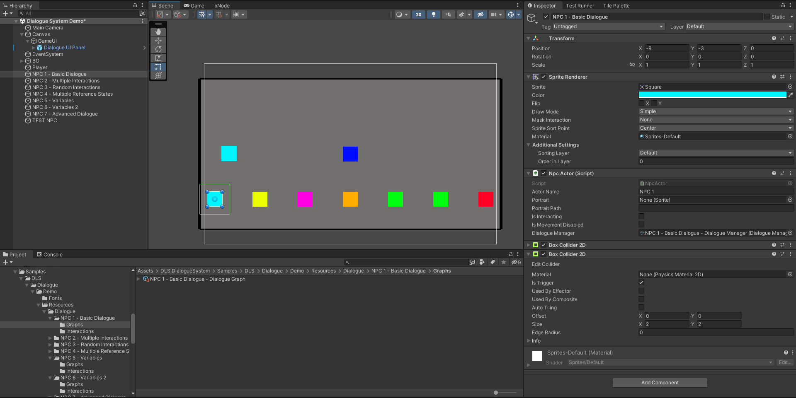
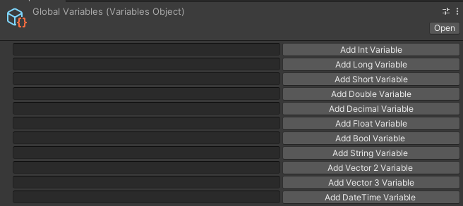
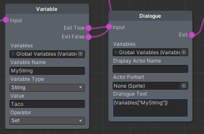
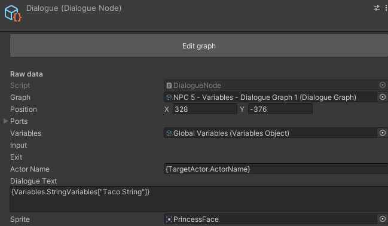

# DLS.Dialogue System

This user guide covers how to use the the DLS.Dialogue System. This guide will cover setup and usage.

## Version

Current version 0.8.0-alpha.1

## Namespaces

You will need to set access to the following Namespaces in order to access the classes included in this package.

Runtime Namespaces:
```cs
using DLS.Core;
using DLS.Dialogue;
using DLS.Utilities.Models;
using DLS.Utilities.Extensions.StringExtensions;
using XNode;
```

Editor Namespaces:
```cs
using DLS.Dialogue.Editor
using DLS.Dialogue.Utilities.Editor;
using XNodeEditor;
```
## Usage

This system uses a node based structure that you can configure and setup dialogues through setting up nodes. In order to get started you need to create multiple scriptable objects for the dialogue configuration. You can access the scriptable objects from the create menu as shown below:



### How to create a new Dialogue

In order to create a Dialogue you need 3 Scriptable Objects as shown above. To get started you create a Dialogue Manager. We suggest that you organize your Dialogue files in a similar way that is shown in the Samples folder. So inside a resources folder ideally. You can setup your structure similar to what is shown below.


Inside the Graphs and Interactions folders you will have the respective Scriptable Objects.

Here are the steps to create a new dialogue.

- 1: Create a Dialogue Manager using the create menu shown in Usage.
- 2: Create a Dialogue Interaction using the create menu shown in Usage.
- 3: Create a Dialogue Graph using the create menu shown in Usage.
- 4: In the Dialogue Interaction set a Dialogue Id (optionally), a Interaction weight (optionally), A Reference State (optionally) A Graph (required) and Repeatable Dialogue (optionally)
- 5: In the Dialogue Manager Leave Current Reference State blank (optionally), and Current Interaction set to None (optionally),
 In the Interactions add all of the interactions you have for this dialogue (required) and set Use Random Dialogue Selection By Weight to true if you want to use random interactions false for not using random interactions. (optionally)
- 6: Finally open up the Dialogue Graph asset that you created and you can start adding Nodes by right clicking and selecting the type of node to create picture shown below:


Here is an example of a basic dialogue graph.

- 7: Setup a new Scene and make a new canvas and drag the Dialogue UI Panel prefeb into the canvas. After that you can create a player and an NPC. using the respective scripts located in DLS.DialogueSystem -> Runtime -> DLS -> Dialogue -> Scripts -> Actor. You add the PlayerActor to the player and the NpcActor to the NPC and configure them accordingly.


- 8: Finally setup a new Npc that has a Dialogue Manager assigned. (You can create your own actors and classes that use this Dialogue Manager reference to handle dialogues.)
  Here is an example of an NPC shown below.
  


- 9 Play test and you should be able to interact with the NPC you created by pressing E when you enter it's trigger range.

That is the basics of getting started.

## Object Parsing Nodes

This system has the capability to parse objects into text for use with the Dialogue System. Currently this feature allows most objects with public fields/properties/indexers/methods to be able to call and return back the string substitution. You can get a deeper dive into this system by reading the Object Parsing String Extensions User Guide. However how it is configured in
the DLS.Dialogue System is that there is a C# class called BaseNode that has properties in that class that you can access from any dialogue node or choice dialogue node. The format is you write out in the Display Actor Name, or the Dialogue Text or the Answers Text a string such as {SourceActor.ActorName} this will grab the SourceActor property and the Name for that actor. This can be used for nearly all forms of properties and fields and methods and indexers on the BaseNode. Here is the class for reference.


## Variables

This system also comes with a Scriptable Object based Variable system that you can use in the DLS.Dialogue System as well as in any code where you wish to use variables in your code. Currently all the supported types of variables are as follows: Int, Long, Short, Double, Decimal, Float, Bool, String, Vector2, Vector3, DateTime.

you can make your own variables object by going to the create menu as shown in Usage and selecting Variables. Here is an example of the inspector for adding variables.


All variables must be uniquely named.

In the Graph Editor for dialogues you can make a Variable node and configure it to Add, Subject, Multiply, Divide, Set, Equal To, Not Equal To, Greater Than, Greater Than Or Equal, Less Than, Less Than Or Equal. Should handle working with variables. To Create a variable you can either use Add or Set, if the variable already exists Add will try to mathematically add whatever value you provide.

You can also access the variables in the Dialogue Node and the Dialogue Choice Node text fields by providing one of the following parsing strings: {Variables["variableNameHere"]} or you can specifically get a type of variable from its properties such as {Variables.StringVariables["variableNameHere"]} replacing StringVariables with whatever type of variable you are looking for.

Examples of this is shown below:





With this system you should be able to capture most of your variable logic without the need to store variables in another container.

## Limitations

- The dialogue system is coupled with the ActorController, PlayerActor, NpcActor, IActorData feel free to modify those classes or extend from them for your own structure.
- The DialogueUi handles all the Ui for the system and is not broken up into smaller chunks so it can be a little bloated.
- Currently the prefab Dialogue UI Panel and DialogChoiceButton has a very basic UI and should be modified to fit your project needs.

That's it! You now have the necessary information to use the DLS.Dialogue System. Enjoy making dialogues and adding life to your projects!
